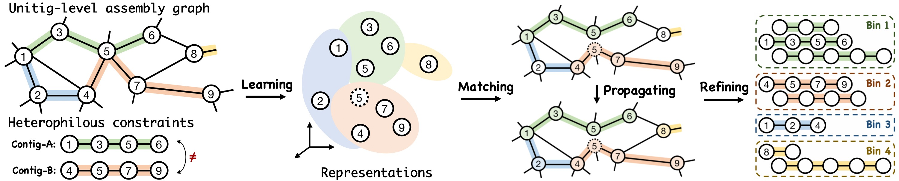

# UnitigBIN
A PyTorch implementation for the [xxx](xxx) paper:<br>
Encoding Unitig-level Assembly Graphs with Heterophilous Constraints for Metagenomic Contigs Binning [[ArXiv](xxx)]<br>

## Overview

<p align="center">
  
</p>

**UnitigBIN** consists of two main components: *Learning*, which uses a graph neural network to model the unitig-level assembly graph while adhering to constraints, and *Binning*, a contig-level framework. In the Binning stage, a *Matching* algorithm is employed to initialize markered contigs, *Propagating* labels are used to annotate unmarked contigs while satisfying constraints, and a local *Refining* strategy is incorporated to fine-tune binning assignment


## Usage
### Requirement
```
Python 3.6
networkx == 1.11
numpy == 1.18
sklearn == 0.22
pytorch == 1.3.1
```
### Reproducibility
To reproduce the experiments on Sim5G dataset, simply run:
```python
python main.py -d Sim5G
```

## Citation
All readers are welcome to star/fork this repository and use it to reproduce our experiments or train your own data. Please kindly cite our paper:
```bibtex
@inproceedings{Xue2023UnitigBIN,
 title = {Encoding Unitig-level Assembly Graphs with Heterophilous Constraints for Metagenomic Contigs Binning},
 author = {Xue, Hansheng and Mallawaarachchi, Vijini and Xie, Lexing and Rajan, Vaibhav},
 booktitle = {},
 pages = {},
 volume = {},
 year = {}
}

```